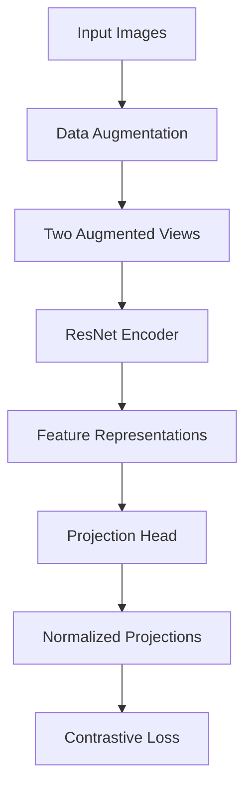

# SimCLR Self-Supervised Learning API

The SimCLR module implements self-supervised contrastive learning for extracting meaningful visual representations from mosquito breeding spot images without requiring extensive labeled data.

## Overview

SimCLR (Simple Contrastive Learning of Visual Representations) learns visual features by maximizing agreement between differently augmented views of the same image. This approach is particularly valuable for our use case where labeled data is limited or unreliable.

### Key Components

- **SimCLRModel**: Main model architecture with ResNet backbone
- **SimCLRDataset**: Dataset class for contrastive learning
- **NTXentLoss**: Normalized Temperature-scaled Cross Entropy loss
- **Training Pipeline**: Complete training workflow with checkpointing

## Quick Start

```python
from prismh.models.simclr import SimCLRModel, train_simclr
import torch

# Initialize model
model = SimCLRModel(base_model='resnet50', pretrained=True)

# Train on your data
train_simclr(
    model=model,
    train_loader=train_loader,
    optimizer=optimizer,
    criterion=criterion,
    device=device,
    epochs=100
)
```

## Command Line Usage

```bash
# Train SimCLR model
python -m prismh.models.simclr \
    --data_dir /path/to/clean/images \
    --output_dir simclr_results \
    --epochs 100 \
    --batch_size 32

# Resume training from checkpoint
python -m prismh.models.simclr \
    --data_dir /path/to/clean/images \
    --output_dir simclr_results \
    --resume_from simclr_results/checkpoints/checkpoint_epoch_50.pt
```

## API Reference

::: prismh.models.simclr
    options:
      members:
        - SimCLRModel
        - SimCLRDataset
        - SimCLRProjectionHead
        - NTXentLoss
        - train_simclr
      show_root_heading: false
      show_source: true
      heading_level: 3

## Architecture Details

### Model Architecture



### Backbone Options

| Backbone | Output Dim | Parameters | Use Case |
|----------|------------|------------|----------|
| ResNet-18 | 512 | 11.7M | Fast experimentation |
| ResNet-50 | 2048 | 25.6M | Recommended for production |

### Data Augmentation Pipeline

```python
transforms = transforms.Compose([
    transforms.RandomResizedCrop(224, scale=(0.2, 1.0)),
    transforms.RandomHorizontalFlip(p=0.5),
    transforms.RandomApply([transforms.ColorJitter(0.4, 0.4, 0.4, 0.1)], p=0.8),
    transforms.RandomGrayscale(p=0.2),
    transforms.ToTensor(),
    transforms.Normalize(mean=[0.485, 0.456, 0.406], std=[0.229, 0.224, 0.225])
])
```

## Training Configuration

### Hyperparameters

| Parameter | Default | Description |
|-----------|---------|-------------|
| `batch_size` | 32 | Batch size for training |
| `learning_rate` | 0.001 | Initial learning rate |
| `temperature` | 0.5 | Temperature for contrastive loss |
| `epochs` | 100 | Number of training epochs |
| `weight_decay` | 1e-4 | L2 regularization |

### Training Features

- **Automatic Mixed Precision**: Faster training with reduced memory
- **Early Stopping**: Prevents overfitting
- **Learning Rate Scheduling**: Adaptive learning rate adjustment
- **Checkpointing**: Resume training from interruptions
- **TensorBoard Logging**: Training metrics visualization

## Usage Examples

### Basic Training

```python
from prismh.models.simclr import SimCLRModel, SimCLRDataset, train_simclr
from torch.utils.data import DataLoader
import torch

# Setup device
device = torch.device('cuda' if torch.cuda.is_available() else 'cpu')

# Create dataset and dataloader
dataset = SimCLRDataset(
    root_dir='data/clean_images',
    transform=get_simclr_transforms()
)
train_loader = DataLoader(dataset, batch_size=32, shuffle=True)

# Initialize model
model = SimCLRModel(base_model='resnet50').to(device)

# Setup training
optimizer = torch.optim.Adam(model.parameters(), lr=0.001)
criterion = NTXentLoss(temperature=0.5, batch_size=32)

# Train model
train_simclr(
    model=model,
    train_loader=train_loader,
    optimizer=optimizer,
    criterion=criterion,
    device=device,
    epochs=100
)
```

### Advanced Training with Validation

```python
from torch.utils.tensorboard import SummaryWriter

# Setup validation
val_dataset = SimCLRDataset('data/val_images', transform=get_simclr_transforms())
val_loader = DataLoader(val_dataset, batch_size=32, shuffle=False)

# Setup logging
writer = SummaryWriter('runs/simclr_experiment')

# Train with validation
train_simclr(
    model=model,
    train_loader=train_loader,
    optimizer=optimizer,
    criterion=criterion,
    device=device,
    epochs=100,
    validation_loader=val_loader,
    writer=writer,
    early_stopping_patience=10
)
```

### Fine-tuning Pretrained Model

```python
# Load pretrained SimCLR model
model = SimCLRModel(base_model='resnet50', pretrained=True)

# Load domain-specific checkpoint
checkpoint = torch.load('pretrained_simclr.pt')
model.load_state_dict(checkpoint['model_state_dict'])

# Fine-tune on your data
train_simclr(
    model=model,
    train_loader=train_loader,
    optimizer=optimizer,
    criterion=criterion,
    device=device,
    epochs=50,  # Fewer epochs for fine-tuning
    checkpoint_dir='finetuned_checkpoints'
)
```

## Feature Extraction

After training, use the encoder for downstream tasks:

```python
# Load trained model
model = SimCLRModel(base_model='resnet50')
checkpoint = torch.load('best_model.pt')
model.load_state_dict(checkpoint['model_state_dict'])

# Extract features
model.eval()
with torch.no_grad():
    features, _ = model(images)
    # Use features for classification, clustering, etc.
```

## Performance Optimization

### Multi-GPU Training

```python
if torch.cuda.device_count() > 1:
    model = torch.nn.DataParallel(model)
```

### Memory Optimization

```python
# Gradient accumulation for larger effective batch size
accumulation_steps = 4
for i, (images1, images2) in enumerate(train_loader):
    # Forward pass
    loss = compute_loss(images1, images2) / accumulation_steps
    loss.backward()
    
    if (i + 1) % accumulation_steps == 0:
        optimizer.step()
        optimizer.zero_grad()
```

### Mixed Precision Training

```python
from torch.cuda.amp import autocast, GradScaler

scaler = GradScaler()

for images1, images2 in train_loader:
    with autocast():
        loss = compute_loss(images1, images2)
    
    scaler.scale(loss).backward()
    scaler.step(optimizer)
    scaler.update()
```

## Monitoring and Visualization

### TensorBoard Integration

```python
# Log training metrics
writer.add_scalar('Loss/Train', loss.item(), epoch)
writer.add_scalar('Learning_Rate', optimizer.param_groups[0]['lr'], epoch)

# Log embeddings
writer.add_embedding(features, metadata=labels, tag='SimCLR_Features')
```

### t-SNE Visualization

```python
from sklearn.manifold import TSNE
import matplotlib.pyplot as plt

# Extract features
features = extract_features(model, dataloader)

# Reduce dimensionality
tsne = TSNE(n_components=2, random_state=42)
features_2d = tsne.fit_transform(features)

# Plot
plt.scatter(features_2d[:, 0], features_2d[:, 1])
plt.title('SimCLR Features t-SNE')
plt.show()
```

## Model Evaluation

### Downstream Task Performance

```python
# Evaluate on classification task
from sklearn.linear_model import LogisticRegression
from sklearn.metrics import accuracy_score

# Extract features
features = extract_features(model, dataloader)

# Train classifier
classifier = LogisticRegression()
classifier.fit(features, labels)

# Evaluate
predictions = classifier.predict(test_features)
accuracy = accuracy_score(test_labels, predictions)
print(f'Classification accuracy: {accuracy:.3f}')
```

### Clustering Quality

```python
from sklearn.cluster import KMeans
from sklearn.metrics import silhouette_score

# Cluster features
kmeans = KMeans(n_clusters=5)
cluster_labels = kmeans.fit_predict(features)

# Evaluate clustering
silhouette = silhouette_score(features, cluster_labels)
print(f'Silhouette score: {silhouette:.3f}')
```

## Troubleshooting

### Common Issues

**Out of memory errors:**
```python
# Reduce batch size
batch_size = 16  # Instead of 32

# Use gradient accumulation
accumulation_steps = 2
```

**Slow convergence:**
```python
# Increase learning rate
optimizer = torch.optim.Adam(model.parameters(), lr=0.003)

# Adjust temperature
criterion = NTXentLoss(temperature=0.3)
```

**Poor feature quality:**
```python
# Increase augmentation strength
transforms.RandomApply([transforms.ColorJitter(0.8, 0.8, 0.8, 0.2)], p=0.8)

# Train for more epochs
epochs = 200
```

## Integration with Pipeline

### With Preprocessing

```python
from prismh.core.preprocess import ImagePreprocessor

# Preprocess first
preprocessor = ImagePreprocessor(input_dir='raw/', output_dir='processed/')
preprocessor.run_preprocessing()

# Then train SimCLR on clean images
dataset = SimCLRDataset('processed/clean')
# ... training code
```

### With Classification

```python
# After SimCLR training, use for classification
from prismh.models.classify import train_classifier

# Use SimCLR encoder as backbone
encoder = model.encoder
train_classifier(encoder, labeled_data)
```

## Related Documentation

- [Feature Extraction](../core/extract_embeddings.md) - Extract embeddings using trained SimCLR
- [Classification](classify.md) - Downstream classification tasks
- [Clustering](../core/cluster_embeddings.md) - Unsupervised analysis
- [Configuration](../../guide/configuration.md) - Training parameter tuning 