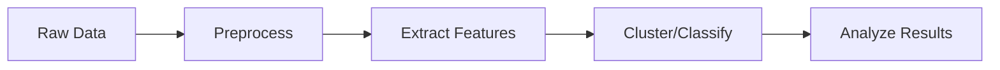

# Quick Start Guide

This guide will walk you through running your first mosquito breeding spot analysis with Prism-H.

## Prerequisites

Make sure you have completed the [installation](installation.md) process and have:

- Prism-H installed and environment activated
- Sample data available (images + metadata JSON)
- Basic understanding of the project structure

## Basic Workflow

The typical Prism-H workflow consists of these steps:



## Step 1: Prepare Your Data

### Data Structure

Organize your data following this structure:

```
data/
├── images/
│   ├── IMG_001.jpg
│   ├── IMG_002.jpg
│   └── ...
└── metadata/
    └── annotations.json
```

### Sample Data

If you don't have data yet, you can use the sample dataset:

```bash
# Download sample data (if available)
python scripts/download_sample_data.py --output data/
```

## Step 2: Data Preprocessing

Clean and filter your image data:

```bash
# Basic preprocessing
python -m prismh.core.preprocess \
    --data_dir data/images \
    --output_dir results/preprocessing \
    --sample_size 5000

# Or using the full dataset
python -m prismh.core.preprocess \
    --data_dir /path/to/all_images \
    --metadata /path/to/metadata.json \
    --output_dir results/preprocessing
```

### Understanding Results

The preprocessing step creates:

- `results/preprocessing/clean/` - High-quality images
- `results/preprocessing/problematic/` - Filtered out images
  - `invalid/` - Corrupted images
  - `duplicates/` - Duplicate images
  - `blurry/` - Low-quality images
  - `dark/` - Poorly lit images
  - `outliers/` - Unusual images

## Step 3: Feature Extraction

Extract features using the SimCLR model:

```bash
# Extract embeddings from clean images
python -m prismh.core.extract_embeddings \
    --input_dir results/preprocessing/clean \
    --output_dir results/embeddings \
    --model_path models/simclr_pretrained.pt
```

This creates:
- `results/embeddings/all_embeddings.npz` - Feature vectors
- `results/embeddings/metadata.json` - Image metadata

## Step 4: Clustering Analysis

Discover patterns in your data:

```bash
# Cluster similar images
python -m prismh.core.cluster_embeddings \
    --embeddings results/embeddings/all_embeddings.npz \
    --output_dir results/clustering
```

This generates:
- `results/clustering/cluster_gallery.html` - Interactive cluster visualization
- `results/clustering/outlier_gallery.html` - Outlier detection results

## Step 5: Classification

Classify container types:

```bash
# Classify images
python -m prismh.models.classify \
    --embeddings results/embeddings/all_embeddings.npz \
    --labels data/metadata/annotations.json \
    --output_dir results/classification
```

## Step 6: Metadata Integration

Integrate spatial and temporal analysis:

```bash
# Analyze metadata patterns
python -m prismh.data.metadata_integrator \
    --json data/metadata/annotations.json \
    --images results/preprocessing/clean \
    --output_dir results/analysis \
    --worker-quality
```

## Complete Example

Here's a complete example using the command line:

```bash
# Set up paths
DATA_DIR="/Users/kirubeso.r/Documents/ArtPark/all_them_images"
METADATA="/Users/kirubeso.r/Documents/ArtPark/all_jsons/first100k.json"
OUTPUT_DIR="results_sample"

# Step 1: Preprocess
python -m prismh.core.preprocess \
    --data_dir $DATA_DIR \
    --metadata $METADATA \
    --output_dir $OUTPUT_DIR \
    --sample_size 5000

# Step 2: Extract features
python -m prismh.core.extract_embeddings \
    --input_dir $OUTPUT_DIR/clean \
    --output_dir $OUTPUT_DIR/embeddings

# Step 3: Cluster analysis
python -m prismh.core.cluster_embeddings \
    --embeddings $OUTPUT_DIR/embeddings/all_embeddings.npz \
    --output_dir $OUTPUT_DIR/clustering

# Step 4: Generate report
python -m prismh.data.metadata_integrator \
    --json $METADATA \
    --images $OUTPUT_DIR/clean \
    --output_dir $OUTPUT_DIR/analysis \
    --worker-quality
```

## Viewing Results

### Interactive Visualizations

Open the generated HTML files in your browser:

```bash
# View clustering results
open results/clustering/cluster_gallery.html

# View outlier analysis
open results/clustering/outlier_gallery.html

# View metadata analysis
open results/analysis/worker_analysis.html
```

### Command Line Summaries

```bash
# Print summary statistics
python -c "
import json
with open('results/analysis/summary.json') as f:
    data = json.load(f)
    print(f'Total images processed: {data[\"total_images\"]}')
    print(f'Clean images: {data[\"clean_images\"]}')
    print(f'Problematic images: {data[\"problematic_images\"]}')
"
```

## Python API Usage

You can also use the Python API directly:

```python
from prismh.core.preprocess import ImagePreprocessor
from prismh.core.extract_embeddings import extract_embeddings_main
from prismh.core.cluster_embeddings import cluster_main

# Initialize preprocessor
preprocessor = ImagePreprocessor(
    input_dir="data/images",
    output_dir="results/preprocessing"
)

# Run preprocessing
preprocessor.run_preprocessing()

# Extract embeddings
extract_embeddings_main()

# Cluster analysis
cluster_main()
```

## Common Parameters

### Preprocessing Parameters

| Parameter | Description | Default |
|-----------|-------------|---------|
| `--ccthreshold` | Similarity threshold for duplicates | 0.9 |
| `--outlier_distance` | Distance threshold for outliers | 0.68 |
| `--sample_size` | Number of images to process | All |

### Feature Extraction Parameters

| Parameter | Description | Default |
|-----------|-------------|---------|
| `--batch_size` | Batch size for processing | 64 |
| `--model_path` | Path to pretrained model | Auto-detect |
| `--device` | Device to use (cpu/cuda/mps) | Auto-detect |

## Next Steps

- [Configuration Guide](configuration.md) - Customize parameters
- [User Guide](overview.md) - Learn about advanced features
- [API Reference](../api/core/preprocess.md) - Detailed function documentation
- [Examples](../examples/basic_usage.md) - More usage examples

## Troubleshooting

### Common Issues

**"No images found"**
```bash
# Check your data directory structure
ls -la data/images/
```

**"Out of memory"**
```bash
# Reduce batch size
python -m prismh.core.extract_embeddings --batch_size 32
```

**"Model not found"**
```bash
# Check if SimCLR model exists
ls -la models/
# Or train a new model first
python -m prismh.models.simclr --train
```

!!! tip "Performance Tips"
    - Use GPU acceleration when available
    - Start with smaller sample sizes for testing
    - Process images in batches to manage memory usage
    - Use SSD storage for faster I/O operations 