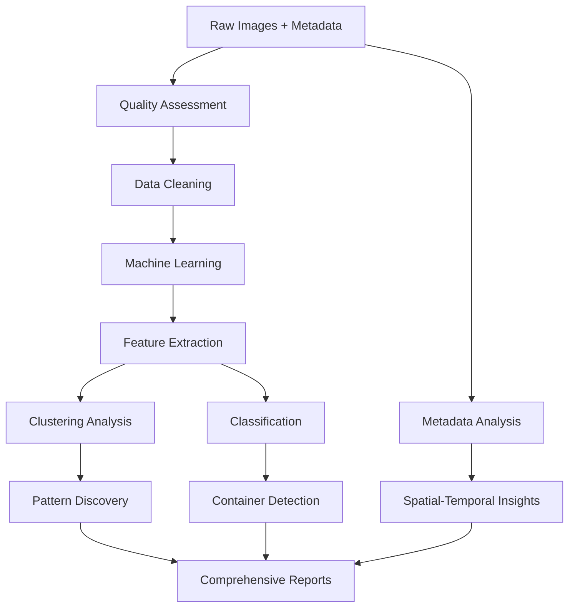

# Prism-H

## Mosquito Breeding Spot Detection & Analysis

---

## Overview

Mosquito-borne diseases pose significant public health challenges, particularly in regions where stagnant water creates ideal breeding conditions. ASHA (Accredited Social Health Activist) workers play a crucial role in identifying and documenting these breeding sites, but face critical challenges in data quality and workflow efficiency.

### The Challenge
Mislabeled containers and missing annotations create unreliable datasets that are difficult to work with. Duplicate image submissions from the same locations waste time and resources that could be better allocated elsewhere. Poor image quality due to lighting and focus issues makes it challenging to identify containers accurately. Inconsistent data collection protocols across different workers and regions create additional complications in maintaining dataset integrity.

### Resource Constraints
Limited training on effective image capture techniques leads to suboptimal data collection practices. Without real-time quality assessment or feedback mechanisms, workers cannot improve their techniques during fieldwork. Time-intensive manual sorting and analysis workflows make it difficult to scale implementation and respond quickly to newly identified breeding sites.

### Our Solution
Prism-H uses a multi-stage AI pipeline that combines machine learning, computer vision, and geospatial analysis to streamline mosquito breeding spot identification and analysis. Automated image quality assessment and data cleaning reduce the amount of manual work required. Feature learning processes images without needing extensive labeled datasets. Container type classification and object detection help identify different breeding site types. Spatial-temporal analysis using GPS coordinates and timestamps reveals patterns that emerge over time. Real-time feedback systems help optimize data collection processes in the field.

---

## Key Features

### Data Processing
Automated detection of invalid, duplicate, blurry, and dark images using quality filtering algorithms. Helps reduce manual review time while improving dataset quality.

### Feature Extraction
Feature extraction that learns domain-specific representations without requiring extensive labeled datasets. Enables robust analysis even with unreliable ground truth labels.

### Object Identification
Multi-class container recognition system that identifies drums, sumps, plant pots, and other breeding site types. Includes confidence scoring and uncertainty quantification.

### Geospatial Analysis
Location-based analysis for hotspot identification, territory optimization, and duplicate detection. Temporal pattern recognition for seasonal breeding cycle analysis.

### Analytics
Pattern discovery through clustering analysis, worker performance insights, and intervention effectiveness tracking.

---

## Architecture

---

## Main Components

| Component | Purpose | Key Features |
|-----------|---------|--------------|
| **[Preprocessing](api/core/preprocess.md)** | Data cleaning and quality control | Invalid/duplicate/blur/dark image detection |
| **[Feature Extraction](api/core/extract_embeddings.md)** | Generate image embeddings | Feature extraction |
| **[Feature Learning](api/models/simclr.md)** | Self-supervised learning | Domain-specific feature learning |
| **[Object Detection](guide/overview.md)** | Container identification | Open-vocabulary object detection |
| **[Metadata Integration](guide/overview.md)** | Behavioral analysis | GPS, timestamp, and worker ID analysis |

---

## Project Goals

### Immediate Objectives
Reduce manual data cleaning and review time. Improve overall data quality and consistency across all submissions. Decrease duplicate submissions through location analysis. Enable faster intervention response times for health teams.

### Long-term Vision
Enhance public health outcomes through improved mosquito control strategies. Optimize resource allocation for intervention teams based on data-driven insights. Provide training and development support for ASHA workers. Create scalable solutions that can be replicated across different regions and communities.

---

## Getting Started

**Installation**
- [Installation Guide](guide/installation.md) - Environment setup
- [Configuration](guide/configuration.md) - Project configuration
- [Quick Start](guide/quickstart.md) - First analysis

**Documentation**  
- [Project Overview](guide/overview.md) - Technical details
- [API Reference](api/core/preprocess.md) - Function documentation
- [Usage Examples](examples/basic_usage.md) - Implementation examples
